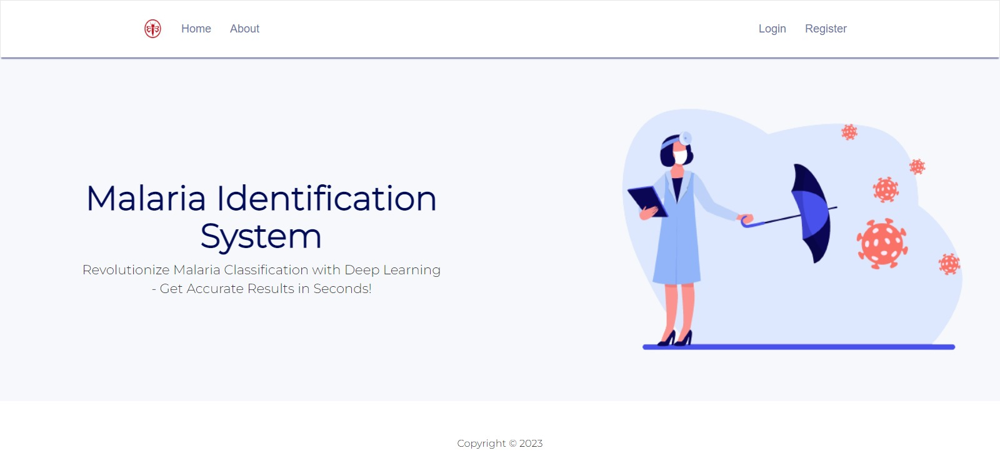
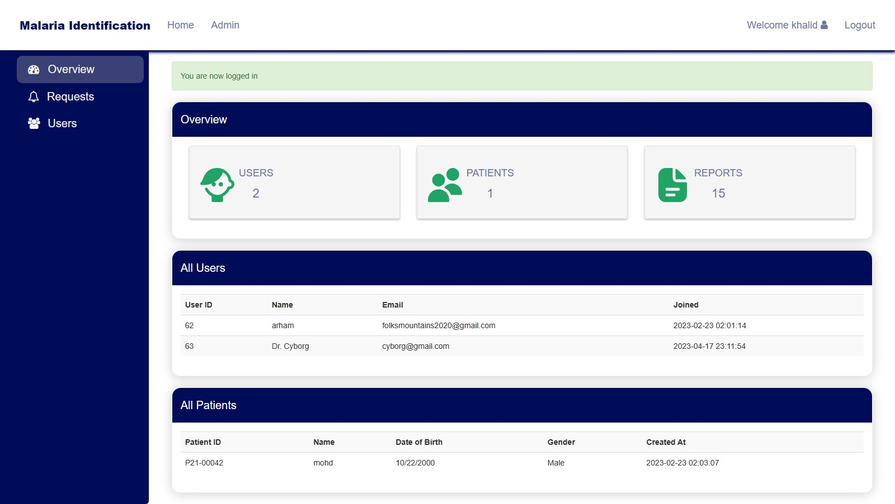
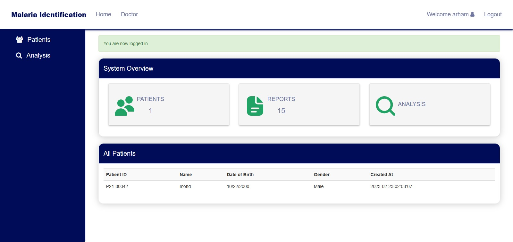
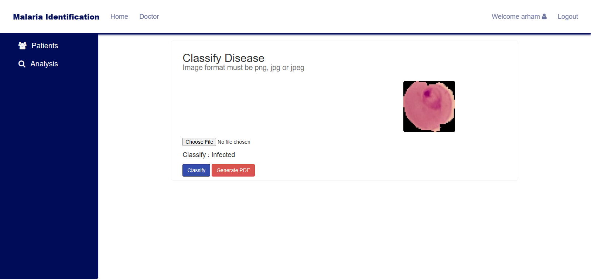

# Malaria Identification System

## Introduction

This is a web application project for identifying malaria using Flask. The application is designed to provide a user-friendly interface for users to upload and analyze blood smear images to detect the presence of malaria parasites. The project also uses XAMPP for database management and includes a `db.sql` file that can be imported into the MySQL server in XAMPP for database operations.

<div style="display: flex; justify-content: space-between;">
    
    
</div>
<div style="display: flex; justify-content: space-between;">
    
    
</div>

## Features

- **User Roles**: The application supports two user roles:
  - **Admin**: Admins can manage users, access all patient data and approve doctors.
  - **Doctor**: Doctors can view patient data, upload new patient records, and analyze blood smear images.
- **Patient Management**: Add, edit, and delete patient records, including patient information, medical history, and test results.
- **Image Upload:** Upload blood smear images for malaria identification.
- **Image Processing:** The uploaded images are processed to detect malaria parasites.
- **Results Display:** The application displays the results of the malaria detection.
- **Database Integration:** XAMPP is used for database management, allowing you to store user data and analysis results.

## Prerequisites

Before you get started, make sure you have the following installed:

- Python 3.x
- XAMPP (or any other MySQL server)
- MySQL Connector for Python

## Installation

1. Clone this repository to your local machine:

   ```bash
   git clone https://github.com/khalid-akhss19/Malaria-Identification-System.git
    ```

2. Create a virtual environment (optional but recommended):

    ```bash
    python -m venv venv
    ```
    Activate the virtual environment:

    - On Windows:
    ```bash
    venv\Scripts\activate
    ```

    - On macOS and Linux:

    ```bash
    source venv/bin/activate
    ```

 3. Install the required Python packages:

    ```bash
    pip install -r requirements.txt
    ```

4. Import the db.sql file into your MySQL server using phpMyAdmin or the MySQL command line.

## Usage
Start the Flask application:

```bash
python app.py
```
- Access the application in your web browser.
- Use the application to upload blood smear images and view the results.

## Classification Models
- [Models](https://github.com/arham-kk/malaria-detection-models)

## Documentation and User Guide
- [Documentation](https://drive.google.com/file/d/140z31hW83SHYnrqMAkuv7DImIJaaEYuZ/view?usp=sharing)
- [User Manual](https://drive.google.com/file/d/10lof8BOd-59U1qoX1_HwLgsQxBYVelTL/view?usp=sharing)

## Contributors
- [Khalid Hussain](https://github.com/khalid-akhss19)
- [Muhammad Arham Khan](https://github.com/arham-kk)
